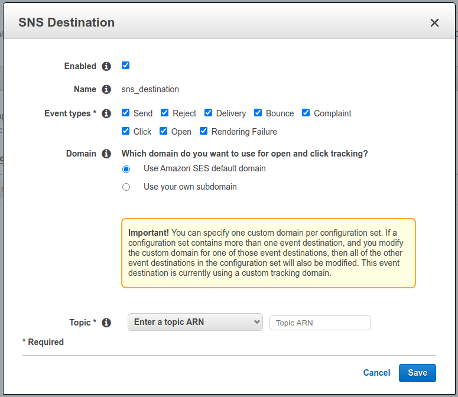
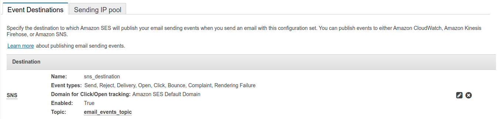

# Serverless Email Service

Serverless Architecture for a generic mechanism to send 
emails in AWS through an API endpoint...
___________________________________________________________________


### Environment Variables
```batch
export AWS_SAM_STACK_NAME=serverless-email-service
```

### Clone repository
```batch
git clone https://github.com/alekglez/serverless-email-service.git
```

### Create virtual environment
```batch
cd serverless-email-service
virtualenv --python=python3.8 .venv
source .venv/bin/activate
```

### Install libraries
```batch
pip install -r email_service/requirements.txt
```

### Test and test coverage
```batch
python manager.py test
python manager.py coverage
```

### Deploy the application
AWS SAM provides you with a command line tool, the AWS SAM CLI (you need 
to install it), that makes it easy for you to create and manage 
serverless applications.
```batch
cd email_service
sam build
sam deploy --stack-name serverless-email-service --s3-bucket serverless-email-service --capabilities CAPABILITY_NAMED_IAM
```

### Create an Event Destination
Currently, you can't specify an Amazon SNS event destinations in a 
CloudFormation templates, that's why you need to do it manually, then go to:
```text
https://console.aws.amazon.com/ses/home?region=us-east-1#edit-configuration-set:EmailServiceConfigurationSet
```




### Add and verify a new email address
Amazon SES requires that you verify your identities (the domains or email addresses 
that you send email from) to confirm that you own them, and to prevent unauthorized 
use. This section includes information about verifying email address identities.
```text
https://console.aws.amazon.com/ses/home?region=us-east-1#verified-senders-email:
```

### Upload a file to the S3 bucket
To test an email sending using attachments upload a file to the 
bucket, below an example... 
```text
aws s3 cp /home/alejandro/Downloads/ticket.pdf s3://email-service-bucket
```

### Testing the email sending

#### With attachments
```batch
curl --location --request POST 'https://server-url/prod/send_email' \
--header 'Accept: application/json' \
--header 'Content-Type: application/json' \
--data-raw '{
    "Destination": {
        "BccAddresses": [
        ],
        "CcAddresses": [
            
        ],
        "ToAddresses": [
            "alek.cora.glez@gmail.com"
        ]
    },
    "Message": {
        "Body": {
            "Html": {
                "Charset": "UTF-8",
                "Data": "Test. https://as.com"
            },
            "Text": {
                "Charset": "UTF-8",
                "Data": "Test"
            }
        },
        "Subject": {
            "Charset": "UTF-8",
            "Data": "Test email"
        }
    },
    "Source": "alek.cora.glez@gmail.com",
    "ConfigurationSetName": "EmailServiceConfigurationSet",
    "Attachments": [
        {
            "Bucket": "email-service-bucket",
            "Key": "ticket.pdf",
            "Name": "ticket",
            "Ext": "pdf"
        },
        {
            "Bucket": "email-service-bucket",
            "Key": "Aporte.pdf",
            "Name": "aporte",
            "Ext": "pdf"
        }
    ]
}'
```

#### Without an attachment
```batch
curl --location --request POST 'https://server-url/prod/send_email' \
--header 'Accept: application/json' \
--header 'Content-Type: application/json' \
--data-raw '{
    "Destination": {
        "BccAddresses": [
        ],
        "CcAddresses": [
            
        ],
        "ToAddresses": [
            "alek.cora.glez@gmail.com"
        ]
    },
    "Message": {
        "Body": {
            "Html": {
                "Charset": "UTF-8",
                "Data": "Test. https://as.com"
            },
            "Text": {
                "Charset": "UTF-8",
                "Data": "Test. https://as.com"
            }
        },
        "Subject": {
            "Charset": "UTF-8",
            "Data": "Test email"
        }
    },
    "Source": "alek.cora.glez@gmail.com",
    "ConfigurationSetName": "EmailServiceConfigurationSet"
}'
```
